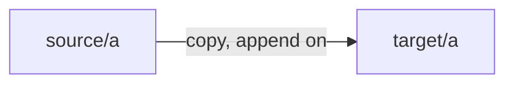
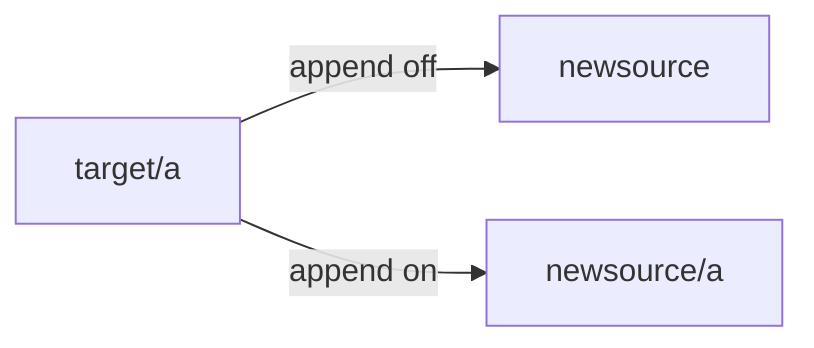

# B0 — Path layout (backup / restore)

**Index:** [A0](./A0-mybackup-design.md) · **Registration:** [B4](./B4-mybackup-design-registration.md)

## Backup (append folder checked)

Registered **target** + **source/a**:



```text
source/a  -->  target  ==>  target/a
```

Implemented via `includeSourceRoot` / “Append source root folder name” in `src/core/pathPlanner.js`.

## Restore

Click Restore asks for a destination folder (`newsource`). [B1](./B1-mybackup-design-restore.md) · [RST-02](./backlog/restore/RST-02-restore-asks-destination.md)



```text
Restore (append off):  target/a  -->  newsource
Restore (append on):   target/a  -->  newsource/a
```

Missing/empty `target/a` → copy nothing.

**Backlog:** [RST-01](./backlog/restore/RST-01-restore-path-and-pause.md)

## Code

- `src/core/pathPlanner.js`
