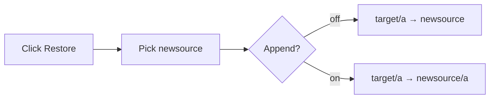

# B1 — Restore

**Index:** [A0](./A0-mybackup-design.md) · **Registration:** [B4](./B4-mybackup-design-registration.md) · **Paths:** [B0](./B0-mybackup-design-path-layout.md) · **Prior note:** [restore-source-progress.md](./restore-source-progress.md)

Layer that copies files from the backup tree under a target into a local destination.

Pause / Resume use the same **bookmark** model as backup ([B3](./B3-mybackup-design-backup-status.md)): folder cursor + completed work; Pause saves it; Stop clears it. Restore stores its bookmark in the restore job file, not `backupJob`.

---

## Locked (current)

Restore is **source-row–centric**. It starts from a registered source on this Mac, not from a volume catalog ([B4](./B4-mybackup-design-registration.md)).

### Who can restore

```mermaid
flowchart LR
  T["targets.json"] --> row["Source row in UI"]
  S["sources/id.json"] --> row
  row --> click["Click Restore"]
  click --> lookup["app:restore-source<br/>lookup sourceId"]
  lookup -->|missing| err["Source not found"]
  lookup -->|found| dest["ask where to restore"]
```

1. This Mac has the target in `data/targets.json`.
2. This Mac has the source in `data/sources/<sourceId>.json`.
3. The user clicks **Restore** on that source row (`runRestoreSource` → `app:restore-source`).
4. Main process looks up `sourceId` in the local schema. Unknown source → error. No picker for “open a backup drive.”

### Destination

Click Restore **always asks where to restore**. The registered `sourcePath` is only the folder-dialog default, not the destination.

| Case | What the app does |
|---|---|
| New restore | Folder picker for `newsource`. Then confirm, with “Append source folder name”. |
| Append off | `target/a` → `newsource` (contents of `a` go into the chosen folder). |
| Append on | `target/a` → `newsource/a` |
| Cancel picker or confirm | Restore does not start. |
| Resume of a paused restore | Reuse the job’s folder + append flag. No second picker. |
| Checkbox default | The source’s `includeSourceRoot` (the add-source append switch). |



```text
Backup (append on):   source/a --> target ==> target/a
Restore (append off): target/a --> newsource
Restore (append on):  target/a --> newsource/a
Missing/empty target/a --> copy nothing
```

The engine walks `getSourceTargetRoot` on the target and writes into `destinationRoot`. It does not read a catalog or hash index from the volume. It skips `BACKUP.md` and `.mybackup-info.json` so the backup card is not copied into the destination.

### Copy (keep newer)

Same rule as Full Backup (`keepNewer.js`): only write or overwrite when the backup file is **newer** than the file already in `newsource` (2s mtime tolerance). Missing dest → copy. Dest newer or same age → skip, leave it.

```text
backup file newer   → write / overwrite
dest missing        → write
dest newer or same  → skip
```

### Consequence

On a computer with no registered source or target, Restore cannot start even if the backup drive is attached. That is current design, not a gap in the copy engine.

---

## Active delivery

| Item | Detail |
|---|---|
| RST-01 | Path + engine pause/resume/stop — [detail](./backlog/restore/RST-01-restore-path-and-pause.md) |
| RST-02 | Click Restore asks for `newsource`; append → `newsource/a` — [detail](./backlog/restore/RST-02-restore-asks-destination.md) |
| UI-01 | Restore panel Pause/Stop chrome — [detail](./backlog/ui/UI-01-restore-run-chrome.md) |

RST-01 out of scope (still current): volume catalog / Mac A `machineId` adopt.

---

## Code

- `src/core/restoreService.js`
- `src/core/restoreDestination.js`
- `src/index.js` — `app:restore-source`
- `src/renderer.js` — `runRestoreSource`
