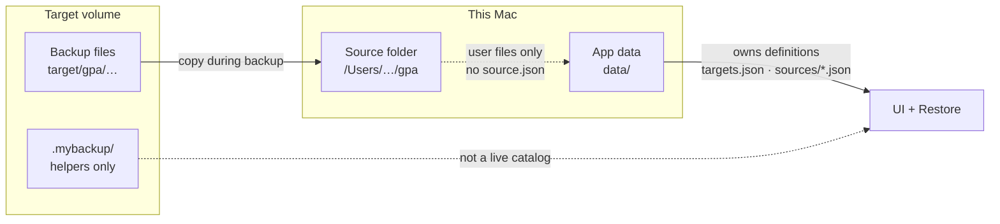
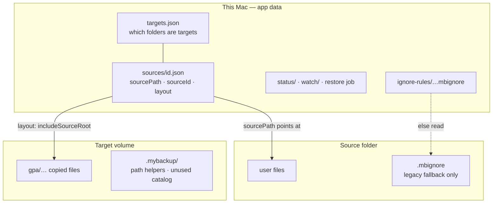
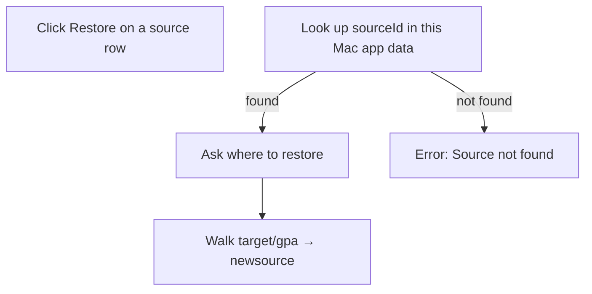
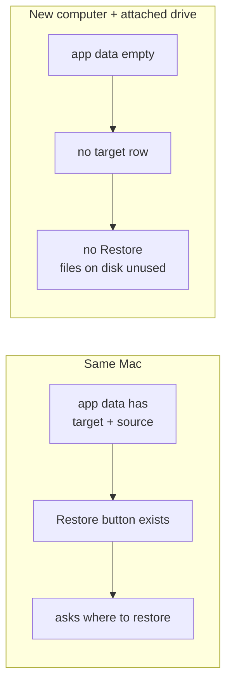
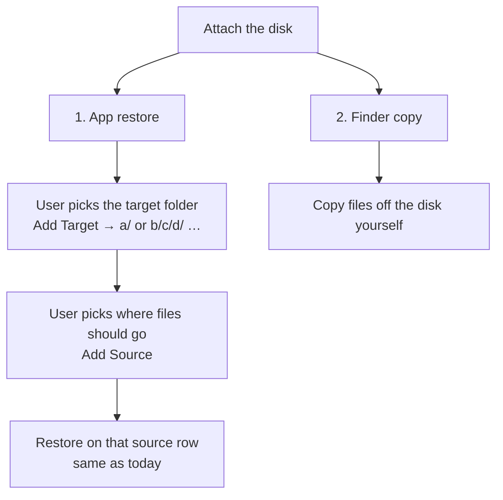

# B4 — Registration / metadata layout

**Index:** [A0](./A0-mybackup-design.md) · **Restore:** [B1](./B1-mybackup-design-restore.md) · **Paths:** [B0](./B0-mybackup-design-path-layout.md)

Where source definitions, target definitions, ignore rules, run status, and the file index live **as implemented**. This is the current design, not a proposed change.

---

## Locked (current)

**Source and target definitions live in this computer’s app data.** They do not live in the source folder. They are not the source of truth on the target volume.

The UI lists only what this machine has registered. Opening a drive that already has backup files does not import a catalog. Restore looks up `sourceId` in local app data first ([B1](./B1-mybackup-design-restore.md)).



App data root (`getAppDataRoot()` in `src/index.js`):

| Build | Path |
|---|---|
| Packaged | `<userData>/data` |
| Dev | `<repo>/data` |

Override: `MYBACKUP_APP_DATA_ROOT`.

---

## Where each piece lives



**Read this as:** the app knows a source because of `data/sources/`, not because of a file inside `gpa`. The drive knows the files because they were copied there. The drive does not tell a new computer which sources exist.

```text
This Mac (app data)          Source folder           Target volume
───────────────────          ─────────────           ─────────────
data/                        /Users/…/gpa/           /Volumes/Backup/
  targets.json               file.doc                  gpa/
  sources/<id>.json  ──path──► (no source.json)          file.doc
  status/                                            .mybackup/
  watch/                                               (helpers only;
  ignore-rules/                                         not the catalog)
```

---

## Stores

| Kind                        | Path                                                   | Written by live backup / UI?                                           | Used to start restore?                     |
| --------------------------- | ------------------------------------------------------ | ---------------------------------------------------------------------- | ------------------------------------------ |
| Target list                 | `data/targets.json`                                    | Yes — add/remove target                                                | Yes. Target must be registered.            |
| Source definition           | `data/sources/<sourceId>.json`                         | Yes — add/remove source                                                | Yes. Source must be registered.            |
| Source status / last run    | `data/status/<sourceId>.json`                          | Yes                                                                    | No (pause/report only).                    |
| Watch / dirty journal       | `data/watch/`                                          | Yes while the app is running                                           | No.                                        |
| Restore job / bookmark      | restore job file under app data                        | Yes                                                                    | Resume only.                               |
| Ignore rules                | `data/ignore-rules/<machine>--<sourceId>.mbignore`     | Yes (Exclude Setting)                                                  | No.                                        |
| Machine record              | inside `targets.json`                                  | Yes                                                                    | Indirect (source rows carry `machineId`).  |
| Backup files                | `target/<sourceRoot>/…`                                | Yes                                                                    | Yes — engine walks this tree after lookup. |
| Target metadata helpers     | `target/.mybackup/`                                    | Path helpers exist; live Full Backup does not write a portable catalog | No.                                        |
| File hash index             | `target/.mybackup/index`                               | Designed; **not written** by current Full Backup                       | No. Restore walks files.                   |
| Per-source record on target | `target/.mybackup/sources/<machineId>/<sourceId>.json` | Path helper + migrate script; not the live registry                    | No.                                        |
| Source folder               | almost empty                                           | Legacy `.mbignore` fallback only                                       | No.                                        |

---

## Source definition (app data)

Created when the user adds a source under a registered target. Record: `createSourceDefinitionRecord` in `src/core/schema.js`.

| Field | Role |
|---|---|
| `machineId`, `sourceId` | Identity on this Mac |
| `targetId` | Which registered target this source belongs to |
| `sourcePath` | Absolute path on **this** machine |
| `targetFolder`, `includeSourceRoot` | How files are laid out under the target ([B0](./B0-mybackup-design-path-layout.md)) |
| `watchEnabled`, `backupIntervalMinutes`, `dirtyRef` | This-machine watch |
| `baselineAt`, `lastCompletedAt`, size fields | Last successful backup on this Mac |

Status, cursor, and `backupJob` live beside the definition (`data/status/`, not in the source folder).

---

## Target definition (app data)

`data/targets.json` is a list of folders this Mac has opened as targets: `id`, `path`, `collapsed`, `addedAt`, plus this machine’s `machine` record.

The dashboard groups sources by those target paths. If `targets.json` is empty, the UI shows no targets and no Restore button, even if a volume is attached and full of files.

---

## Source folder

The registered source path is user data. The app does **not** store the source definition or the file index there.

Exception: if `data/ignore-rules/…` is missing, `loadIgnoreMatcher` may read `source/.mbignore` (legacy fallback). New ignore rules are written under app data.

---

## Target volume

Backup copies files to `target/<sourceRoot>/…` ([B0](./B0-mybackup-design-path-layout.md)).

`src/core/paths.js` also defines `target/.mybackup/` (`TARGET_METADATA_ROOT`): `backup_source.json`, `sources/`, `machines/`, `index/`, scans, reports, tmp. Those paths are used by tests and `scripts/migrate-legacy-metadata.js`. The live add-source / Full Backup path writes definitions to **app data**, not a volume catalog the next computer can read.

Current Full Backup does not call `registerHashRecord`. Restore does not use the hash index; it walks the backup tree.

---

## Consequence (current behavior)





| Situation | What happens |
|---|---|
| Same Mac, target + source still registered | Restore can start. App asks where to restore ([B1](./B1-mybackup-design-restore.md)). |
| Same Mac, source folder missing but still registered | Folder picker still runs. Copy goes to the chosen folder. |
| New computer, empty app data, drive attached | No target row, no source row, no Restore. Files on the drive are unused until the user re-registers. |

---

## Portability — rejected (keep current design)

A marker file (`target/.mybackup/target.json`) was considered so a drive could introduce itself. **Rejected.**

The target can be any folder on the disk (`a/`, `b/f`, `b/c/d/`, `e/`). A marker in the target folder would force a walk of every directory to find it. That is the wrong design. Do not add a volume catalog. Do not copy `targets.json` onto the drive. Do not change registration.

On another computer the user already has two ways. Both fit the current design.

```text
Portable disk
  a/
  b/f
  b/c/d/     ← target can be any of these
  e/
```



| Way | What the user does | App data |
|---|---|---|
| 1. Define the target | Add Target = the backup folder on this mount. Add Source = the destination folder. Click Restore. | This Mac now has target + source definitions. Same as current. |
| 2. Copy/paste | Copy `a/…` or `b/c/d/…` in Finder. | Nothing. App is not involved. |

Way 1 still needs a **source** row. Restore is source-row–centric ([B1](./B1-mybackup-design-restore.md)). The source folder name / append flags must match how files were stored ([B0](./B0-mybackup-design-path-layout.md)), e.g. backup of `gpa` with append on lives at `target/gpa`.

---

## Code

- `src/core/paths.js` — app-data vs `target/.mybackup` path helpers
- `src/core/backupSchema.js` — register / load / list sources and targets
- `src/core/sourceStore.js` — `data/sources/*.json`
- `src/core/targetsStore.js` — `data/targets.json`
- `src/core/ignoreMatcher.js` — app-data ignore + source `.mbignore` fallback
- `src/index.js` — `getAppDataRoot()`, add target/source, `app:restore-source` lookup
