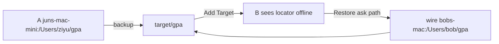

# B5 — Target catalog

**Backlog:** [CAT-01](./backlog/catalog/CAT-01-target-catalog.md) · **Today:** [B4](./B4-mybackup-design-registration.md) · **Restore:** [B1](./B1-mybackup-design-restore.md)

**Status:** shipped (I3)

Add Target reads **one file**: `target/.mybackup/catalog.json`. No folder walk.

```text
computerId   = OS computer name (macOS / Windows / Linux, no .local)
locator      = computerId:/path
set          = one tree on disk     target/gpa
```



| | On target | On this computer |
|---|---|---|
| What | sets + latest backup | local path, watch, pause |
| List / Restore | enough | not needed |
| Backup | + local folder | needed |

```text
target/.mybackup/catalog.json    sets + lastBackup
target/gpa/BACKUP.md             history (cap 200)
data/targets.json                folders this Mac added
data/bindings/<setId>.json       localPath, watch, job
```

```text
same computerId + folder exists  →  online   Backup+Restore
other computerId                 →  offline  Restore only
A ↔ B backup                     →  same tree, keep-newer
history                          →  keep all runs
restore                          →  current tree  (no version pick)
```

```text
Delete source → catalog set + local binding gone
Delete target → catalog.json + local bindings gone
               backup files on disk stay

Do not
  walk volume / walk children for cards
  MAC
  copy data/sources onto disk
```

```text
UI after B Add Target
  gpa   Offline  juns-mac-mini:/Users/ziyu/gpa
        [Restore]

after Restore to /Users/bob/gpa
  gpa   /Users/bob/gpa
        [Changes] [Backup Changes] [Full Backup] [Restore]
```
