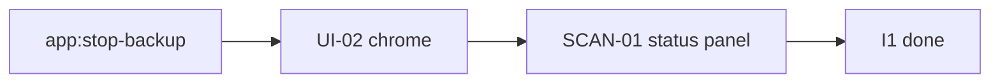

# MyBackup — Iteration 1 plan

**Status:** ✅ done · **Backlog:** [C0-mybackup-backlog.md](./C0-mybackup-backlog.md)  
**Design:** [B0](./B0-mybackup-design-path-layout.md) · [B1](./B1-mybackup-design-restore.md) · [B3](./B3-mybackup-design-backup-status.md)

**Goal:** Restore path + run chrome for restore **and** backup; Full Scan result in the source↔target status panel.

---

## Planned backlog

| ID                                                            | Description                                                                     | Status |
| ------------------------------------------------------------- | ------------------------------------------------------------------------------- | ------ |
| [RST-01](./backlog/restore/RST-01-restore-path-and-pause.md)  | Restore `target/a` → `source/a`; engine pause/resume/stop; empty → copy nothing | ✅      |
| [UI-01](./backlog/ui/UI-01-restore-run-chrome.md)             | Restore click → hide source buttons; show Pause + Stop                          | ✅      |
| [UI-02](./backlog/ui/UI-02-backup-run-chrome.md)              | Full Backup / Full Scan / Backup Changes → Pause + Stop chrome                  | ✅      |
| [SCAN-01](./backlog/backup/SCAN-01-full-scan-result-popup.md) | Full Scan result in status panel (source left / target right)                   | ✅      |

---

## Summary

|             | Count |
| ----------- | ----- |
| ✅ Completed | 4     |
| 🔶 Partial  | 0     |
| 📋 Planned  | 0     |
| ❌ Failed    | 0     |

**Shipped:** Cross-machine restore into `source/a`; restore and backup Pause/Stop chrome; Full Scan result in the source↔target status panel.

---

## Locked design — pause / resume / stop

**SSOT:** [A1](./A1-mybackup-highlevel-design.md) (live tree) · [B3](./B3-mybackup-design-backup-status.md)

- Completeness is not copy / Pause / Resume’s job. A changing tree is never a closed snapshot.
- **Keep folder cursor.** Resume skip-aheads. Inserts before the cursor are the same miss as inserts into an already-finished folder.
- **Unfinished folder = not started.** Cursor = `{ folder, copiedBytes, copiedFiles }` with counts from **finished folders only**. No file list. Resume starts that folder over and accumulates onto those counts.
- Pause and Stop share worker halt (cancel in-flight + temps). Pause **saves** the cursor; Stop **clears** it.
- Do **not** change restore’s job store / file-task pause (RST-01 already shipped).

---

## Implementation — wave 2 (done)

**Already in code (do not redo):** folder-start baseline; Pause persists baseline; Resume seeds it; test `pause treats unfinished folder as not started`.

### 1) Engine — Stop only

**Touch:** `backupCoordinator.js`, `index.js`, `preload.js`

1. **Stop** — new `app:stop-backup`: same halt as Pause, then **clear** `backupJob` / cursor. Two paths: active run, or already-paused idle. `status: 'stopped'`. No Resume.
2. Test: Stop clears job; next run is new (no Resume from that cursor).

### 2) UI-02 — backup run chrome

**Touch:** `renderer.js` (preload already has pause; add `stopBackup`)

1. Run mode like UI-01: running → Pause + Stop; paused → Resume + Stop; terminal → idle.
2. Hide Changes / Restore / Full Backup menu while backup run mode is active.
3. Pause → `app:pause-backup`. Stop → `app:stop-backup`. Resume → existing `runBackup` (`forceNewScan: false`).
4. Tests AT-UI02-1…3.

### SCAN-01 — Full Scan result in status panel (not a modal)

**Touch:** `backupCoordinator.js`, `renderer.js`, `index.html` / progress panel as needed

**UI:** After a Full Scan / Full Backup finishes, show the comparison **in the existing source↔target status panel**:

- **Left = source** (registered folder): file count, total size  
- **Right = target** (this source’s backup tree under `getSourceTargetRoot`): file count, total size  
- Plus: missing count, backed-up yes/no (and copied / errors if useful)

No separate success popup/modal. User stays on the source row; the panel is the result surface.

**When to show / refresh**

- Refresh the panel from the latest `scanResult` whenever a Full Scan / Full Backup (`forceNewScan: true`) reaches `completed`.
- Pause / Stop / fail → do not treat as a successful scan result (keep prior panel state or clear live progress only).
- Backup Changes → no SCAN-01 scan-result refresh (out of scope).

**Metrics (locked — one clear choice)**

| Field | Definition |
|---|---|
| Source count / size | Count and byte sum of files under the registered source path (what the scan walked). |
| Target count / size | Count and byte sum of files under `target / getSourceTargetRoot(source)` — a real walk of that backup folder after the run. **Not** `backupSizeBytes` on the source record (that value today mirrors source size and is not a target inventory). |
| Missing | Source-relative paths that have **no file** at the planned target path. Absence only (no hash/mtime deep-diff). |
| Backed up | `missing === 0` and `errors === 0`. |

**Why this metrics choice:** Left/right panel needs honest “what’s on disk on each side.” Source numbers come from the scan; target numbers come from walking the backup folder for this source. Missing is “on source, not present on target,” which matches a path check during/after the same run.

**Payload:** attach `scanResult` on the completed summary (`forceNewScan` echoed). Renderer binds it into the left/right status panel.

5. Tests: AT-SCAN01 updated for panel (not modal dismiss).

### Docs close

- Mark UI-02 / SCAN-01 ✅ in C0; C2 summary both remaining ✅; C1 roadmap I1 ✅  
- Rename SCAN-01 detail title/summary from “popup” → “status panel” when closing

### Explicit out of scope (still)

- Volume catalog / original-machine adopt  
- Changing backup append semantics  
- Restore completion panel  
- Deep missing-file browser  
- Modal popup for scan results  

---

## Done when

Acceptance in UI-02 and SCAN-01 detail files passes; C2 summary shows all four planned items ✅.
