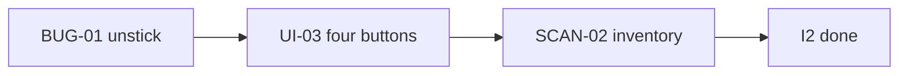

# MyBackup — Iteration 2 plan

**Status:** ✅ done · **Backlog:** [C0-mybackup-backlog.md](./C0-mybackup-backlog.md)  
**Design:** [B3](./B3-mybackup-design-backup-status.md)

**Goal:** Unstick Backup Changes; idle row is four peer icon buttons; last-run report proves the source is fully backed up.

---

## Planned backlog

| ID | Description | Status |
| --- | --- | --- |
| [BUG-01](./backlog/bugs/BUG-01-backup-changes-stuck-running.md) | Backup Changes can stick in running chrome | ✅ |
| [UI-03](./backlog/ui/UI-03-simplify-source-buttons.md) | Idle: Changes, Backup Changes, Full Backup, Restore (no dropdown) | ✅ |
| [SCAN-02](./backlog/backup/SCAN-02-source-count-includes-ignored.md) | Last-run report: Source backed up == Target; Total == Finder | ✅ |

---

## Summary

| | Count |
|---|---|
| ✅ Completed | 3 |
| 🔶 Partial | 0 |
| 📋 Planned | 0 |
| ❌ Failed | 0 |

**Shipped (I1):** Restore path + Pause/Stop chrome; last-run source↔target panel.  
**This iteration:** Fix stuck running; simplify idle buttons; last-run report (Source backed up == Target; Total == Finder).

---

## Locked design

**Do not regress I1:** folder cursor; unfinished folder = not started; Pause saves / Stop clears; restore file-task pause unchanged; last-progress on the size circle after a completed run.

**Buttons (UI-03):** Idle = **Changes · Backup Changes · Full Backup · Restore** as four peer icon buttons. No chevron, no split-button menu. Click Backup Changes / Full Backup / Restore → hide those four; show **Pause + Stop** only. Paused → Resume + Stop. Terminal → idle four. Icon-button style unchanged (label under icon).

**Needs-rescan / no baseline:** still show all four. **Backup Changes** disabled until a baseline exists. **Full Backup** stays a first-class button (never hidden in a menu).

**Stuck running (BUG-01):** Every Backup Changes run must reach a terminal status (`completed` / `paused` / `stopped` / `failed`), including **zero dirty folders**. Renderer run mode is only for **live** status (`running` / `pausing`). Kept last-progress with `completed` is idle. Size circle may open last progress; that is not running.

**SCAN-02:** prove the source is fully backed up. Finder alone cannot (ignored files). The report is the decoder.

```text
Finder source  =  Source backed up  +  Failed  +  Skipped-newer (source bytes)  +  Ignored
Target column  =  Source backed up
```

| Row | Meaning |
|---|---|
| **Source backed up / Target** | Eligible files in sync (copied or already same). Columns must match. |
| **Failed** | Eligible, copy errored. Path + error + source bytes. |
| **Skipped (target newer)** | Do not overwrite. List source size vs target size. Omit if empty. Total uses **source** bytes. |
| **Ignored** | File or folder prune OK (`node_modules/`). Counted in Total/Finder, not copied. |
| **Total** | Sum of source-side buckets. Must match Finder/Explorer. |

Clean run: **Source backed up == Target** (safety) and **Total == Source backed up + Ignored == Finder** (honesty). Skip-newer stays out of the matching columns.

- **Ignore** file or folder is OK. Do not copy. Still count in Total / Ignored.
- **Symlinks:** copy the link itself (Unix/macOS/Linux). Do not drop them unless ignored.
- Headline numbers are **inventories**, not “bytes copied this run.”
- Last-progress panel (size circle), not a modal.

**SCAN-02 + Backup Changes:** do **not** walk the whole source tree on every incremental just to refresh Finder totals. Incremental `scanResult` stays the change set (`kind: 'changes'`). Full inventory-without-ignore is for `mode === 'full'` only.

---

## Implementation

Order: **BUG-01** (P0) → **UI-03** → **SCAN-02**. Do not start UI-03 until Backup Changes returns to idle.



**Already in code (do not redo):** `isLiveProgressStatus`; last-progress keep on complete; `scanResult` persist; Pause/Stop chrome; folder-start baseline.

---

### 1) BUG-01 — Backup Changes must terminate

**Touch:** `backupCoordinator.js` (`scanDirtyFolders` / `filePool.wait` / empty incremental), `renderer.js` (`runBackup`, run-mode guards), tests

**Reproduce first**

1. Source with baseline, **no** dirty folders → Backup Changes.
2. Source with pending changes → Backup Changes until complete.
3. Confirm whether the hang is engine (`app:run-backup` never returns) or renderer (IPC returns, chrome stays live).

**Likely sites (confirm, do not assume one)**

- Incremental with `selectedDirtyFolders === []` still starts the file pool; `fileQueue.close()` + `filePool.wait()` must finish.
- Optimistic `status: 'running'` in `runBackup` stays live if the invoke never settles or the `finally` path skips `rememberBackupProgress` / terminal status.
- Run mode must use `isLiveProgressStatus` only — `completed` last-progress must not show Pause + Stop or `is-copying`.

**Fix**

1. Empty incremental: scan nothing, close queue, emit `backup-completed`, return `status: 'completed'` + `kind: 'changes'` scanResult (zeros ok).
2. Non-empty incremental: same terminal path as today after workers drain.
3. Renderer: on invoke settle, always write a terminal payload (or clear live) so chrome cannot stay `running`. Catch/timeout is not a substitute for engine complete — fix the engine if it hangs.
4. Size circle still hydrates last progress; `isCopying` / Pause+Stop stay off.

**Tests:** AT-BUG01-1…3 (renderer idle after complete / zero-change). Engine: incremental with no dirty folders returns `completed` and does not hang.

---

### 2) UI-03 — four idle icon buttons

**Touch:** `renderer.js` (idle actions HTML + binds), `index.html` (drop split-menu CSS if unused)

**Idle row (always, when not run mode)**

| Button | Class | Action |
|---|---|---|
| Changes | `toggle-changes-button` | unchanged |
| Backup Changes | `run-backup-button` | `runBackup(..., false)` |
| Full Backup | `run-full-scan-button` | `runBackup(..., true)` |
| Restore | `restore-source-button` | unchanged |

No `.backup-action-menu`, no `.backup-action-toggle`, no dropdown. Remove `backupActionMenuOpenKey` / click-outside menu close if nothing else uses it.

**Disabled**

- Backup Changes: `requiresFullBackup` or target unavailable or restore run mode.
- Full Backup / Restore / Changes: same disable rules as today (unavailable, settings mode, etc.).

**Run mode:** keep current Pause + Stop (backup or restore). Do not morph Backup Changes into Pause.

**Tests:** AT-UI03-1…3. Update AT-UI02 / dropdown tests that expect `backup-action-toggle` or a hidden Full Backup.

---

### 3) SCAN-02 — last-run report

**Touch:** `backupCoordinator.js`, `schema.js` (`createScanResult`), `fileTaskProcessor.js` (skip-newer rows), `scannerUtils.js` (symlinks as links), last-progress panel (`progressPanel.js` / card labels), tests

**Full Backup / Full Scan only**

1. Walk `sourcePath` **without** ignore → Total / Finder.
2. Ignore still skips copy (file or folder prune). Copy **symlinks as links**.
3. Persist buckets + `failed[]` + `skippedNewer[]`.
4. Source backed up / Target = in-sync set (source sizes). Do not put skip-newer or failed in those columns.
5. Last-progress panel: Source backed up vs Target; Failed / Ignored / Skipped-newer / Total as report rows.

**Backup Changes:** no full-tree inventory walk. Keep `kind: 'changes'` change-set counts from I1.

**Tests:** AT-SCAN02-1…4 — ignored in Total not copied; skip-newer in its section; failure in Failed; clean run Source backed up == Target and Total == Finder.

---

### Docs close

- Mark BUG-01 / UI-03 / SCAN-02 ✅ in C0, C1, C3, and each detail file.
- C1 current focus → I2 ✅ when all three pass.

### Explicit out of scope

- Changing ignore **copy** rules  
- Changing Finder’s own display rules (bundles as one item) if they disagree with a flat file walk  
- Restore completion panel  
- Changing icon artwork  
- Volume catalog / append semantics  
- Walking the whole source on every Backup Changes for SCAN-02  

---

## Done when

Acceptance in BUG-01, UI-03, and SCAN-02 detail files passes; C3 summary shows all three ✅.
