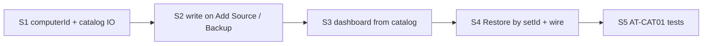

# C5 — I3 plan (target catalog)

**Status:** ✅ · **Backlog:** [CAT-01](./backlog/catalog/CAT-01-target-catalog.md) · **Design:** [B5](./B5-mybackup-design-target-catalog.md)

**Goal:** Add Target → see sets. Restore wires `computerId:/path`. No disk walk.

Do **not** replace `data/sources/` in this iteration. Add `setId` + treat local source as the **binding**. Catalog on the target is the list.

---

**Shipped:** `src/core/targetCatalog.js` · `__tests__/targetCatalog.test.js` · `__tests__/catalogAcceptance.test.js` (AT-CAT01-1…6) · `__tests__/e2ePortTarget.test.js` (E2E-PORT-01…05)

## Slices (stop after each)



| Slice | Do | Stop when |
|---|---|---|
| **S1** | Persist `computerId` (uuid, once) on machine/app config. New `targetCatalog.js`: read/write `target/.mybackup/catalog.json`. Unit tests only. | Catalog round-trip green. No UI. |
| **S2** | Add Source → upsert set (`setId`, locator, `relativeRoot`). Backup complete → `lastBackup`. Add Target / first backup: if catalog missing, **seed from this Mac’s sources** (not a child walk). Store `setId` on local source. | A’s target has catalog after backup. Existing A targets get a catalog without listing `gpa/`. |
| **S3** | Dashboard rows = catalog sets ∪ local bindings. Offline: Restore on, Backup off. Online: all four. | B Add Target shows A’s `gpa` offline. |
| **S4** | Restore lookup by `setId` (catalog), not “must exist in data/sources”. On success: register/update local source (`sourcePath` = dest, same `setId`), append locator to catalog. | B Restore → files + online row. |
| **S5** | AT-CAT01-1…6 in `__tests__` (engine; UI chrome assert in renderer if cheap). | All six ATs green. Full jest green. |

---

## Touch

```text
new     src/core/targetCatalog.js
        __tests__/targetCatalog.test.js
edit    schema.js / machineRegistry     computerId
        sourceRegistry / backupSchema   setId on source
        backupCoordinator.js            lastBackup after card
        index.js                        add-target seed; restore by setId; wire
        renderer.js                     offline row
        restoreService.js               walk relativeRoot from catalog
```

Keep: `keepNewer`, card write, RST-02 picker, watch on local `sourceId`.

---

## Migrate (A, already registered)

```text
Add Target or next Backup
  catalog missing → build sets from data/sources for that target
  write catalog.json
  do not readdir gpa/, photos/
```

---

## Out of this iteration

- New `data/bindings/` store (use `data/sources/` + `setId`)
- Copy ignore onto the target
- Version picker
- Volume walk / child-card import
- I3 UI polish beyond offline/online buttons
